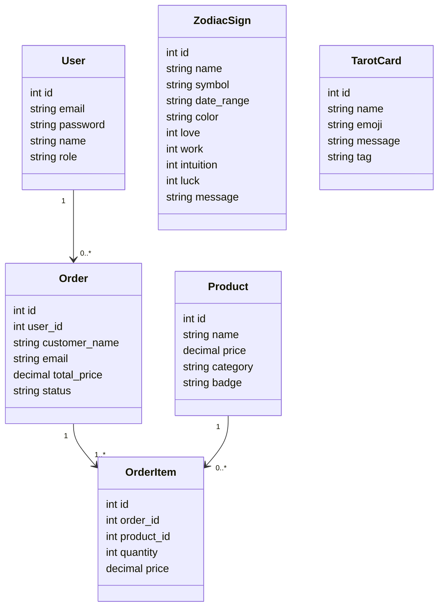
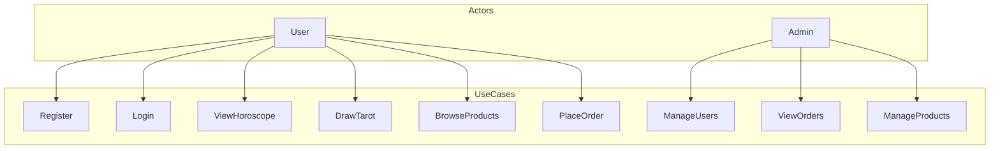
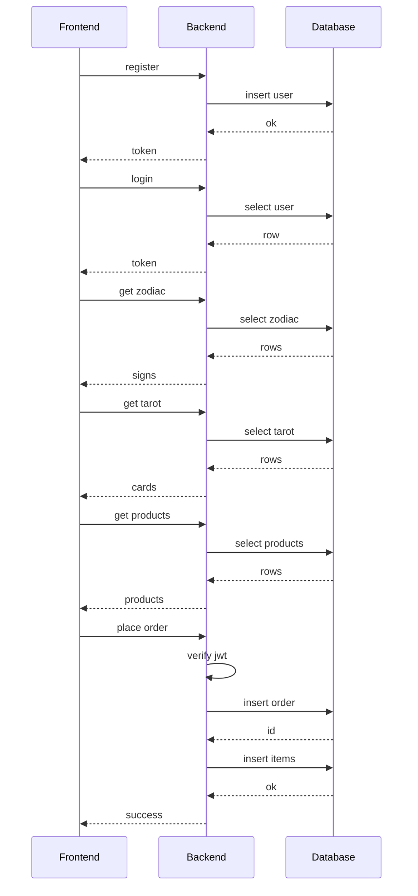

```mermaid
classDiagram
    class User {
        int id
        string email
        string password
        string name
        string role
    }
    class ZodiacSign {
        int id
        string name
        string symbol
        string date_range
        string color
        int love
        int work
        int intuition
        int luck
        string message
    }
    class Product {
        int id
        string name
        decimal price
        string category
        string badge
    }
    class TarotCard {
        int id
        string name
        string emoji
        string message
        string tag
    }
    class Order {
        int id
        int user_id
        string customer_name
        string email
        decimal total_price
        string status
    }
    class OrderItem {
        int id
        int order_id
        int product_id
        int quantity
        decimal price
    }
    User "1" --> "0..*" Order
    Order "1" --> "1..*" OrderItem
    Product "1" --> "0..*" OrderItem
```

```mermaid
flowchart TB
    subgraph Actors
        A1[User]
        A2[Admin]
    end
    subgraph UseCases
        Register
        Login
        ViewHoroscope
        DrawTarot
        BrowseProducts
        PlaceOrder
        ManageUsers
        ViewOrders
        ManageProducts
    end
    A1 --> Register
    A1 --> Login
    A1 --> ViewHoroscope
    A1 --> DrawTarot
    A1 --> BrowseProducts
    A1 --> PlaceOrder
    A2 --> ManageUsers
    A2 --> ViewOrders
    A2 --> ManageProducts
```

```mermaid
sequenceDiagram
    participant Frontend
    participant Backend
    participant Database
    Frontend->>Backend: register
    Backend->>Database: insert user
    Database-->>Backend: ok
    Backend-->>Frontend: token
    Frontend->>Backend: login
    Backend->>Database: select user
    Database-->>Backend: row
    Backend-->>Frontend: token
    Frontend->>Backend: get zodiac
    Backend->>Database: select zodiac
    Database-->>Backend: rows
    Backend-->>Frontend: signs
    Frontend->>Backend: get tarot
    Backend->>Database: select tarot
    Database-->>Backend: rows
    Backend-->>Frontend: cards
    Frontend->>Backend: get products
    Backend->>Database: select products
    Database-->>Backend: rows
    Backend-->>Frontend: products
    Frontend->>Backend: place order
    Backend->>Backend: verify jwt
    Backend->>Database: insert order
    Database-->>Backend: id
    Backend->>Database: insert items
    Database-->>Backend: ok
    Backend-->>Frontend: success
```
