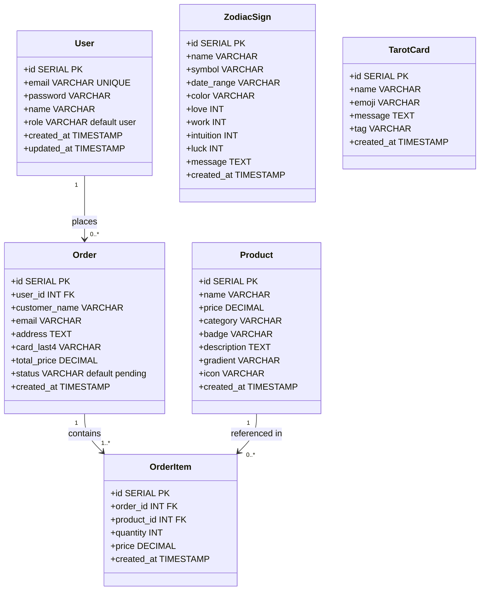
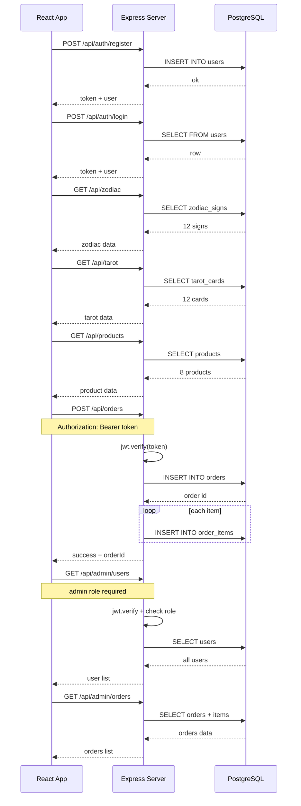
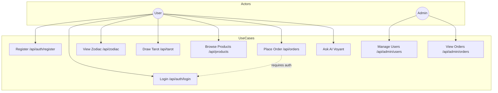

```mermaid
classDiagram
    class User {
        +id SERIAL PK
        +email VARCHAR UNIQUE
        +password VARCHAR
        +name VARCHAR
        +role VARCHAR default user
        +created_at TIMESTAMP
        +updated_at TIMESTAMP
    }
    class ZodiacSign {
        +id SERIAL PK
        +name VARCHAR
        +symbol VARCHAR
        +date_range VARCHAR
        +color VARCHAR
        +love INT
        +work INT
        +intuition INT
        +luck INT
        +message TEXT
        +created_at TIMESTAMP
    }
    class Product {
        +id SERIAL PK
        +name VARCHAR
        +price DECIMAL
        +category VARCHAR
        +badge VARCHAR
        +description TEXT
        +gradient VARCHAR
        +icon VARCHAR
        +created_at TIMESTAMP
    }
    class TarotCard {
        +id SERIAL PK
        +name VARCHAR
        +emoji VARCHAR
        +message TEXT
        +tag VARCHAR
        +created_at TIMESTAMP
    }
    class Order {
        +id SERIAL PK
        +user_id INT FK
        +customer_name VARCHAR
        +email VARCHAR
        +address TEXT
        +card_last4 VARCHAR
        +total_price DECIMAL
        +status VARCHAR default pending
        +created_at TIMESTAMP
    }
    class OrderItem {
        +id SERIAL PK
        +order_id INT FK
        +product_id INT FK
        +quantity INT
        +price DECIMAL
        +created_at TIMESTAMP
    }
    User "1" --> "0..*" Order : places
    Order "1" --> "1..*" OrderItem : contains
    Product "1" --> "0..*" OrderItem : referenced in
```

```mermaid
sequenceDiagram
    participant Client as React App
    participant API as Express Server
    participant DB as PostgreSQL
    Client->>API: POST /api/auth/register
    API->>DB: INSERT INTO users
    DB-->>API: ok
    API-->>Client: token + user
    Client->>API: POST /api/auth/login
    API->>DB: SELECT FROM users
    DB-->>API: row
    API-->>Client: token + user
    Client->>API: GET /api/zodiac
    API->>DB: SELECT zodiac_signs
    DB-->>API: 12 signs
    API-->>Client: zodiac data
    Client->>API: GET /api/tarot
    API->>DB: SELECT tarot_cards
    DB-->>API: 12 cards
    API-->>Client: tarot data
    Client->>API: GET /api/products
    API->>DB: SELECT products
    DB-->>API: 8 products
    API-->>Client: product data
    Client->>API: POST /api/orders
    Note over Client,API: Authorization: Bearer token
    API->>API: jwt.verify(token)
    API->>DB: INSERT INTO orders
    DB-->>API: order id
    loop each item
        API->>DB: INSERT INTO order_items
    end
    API-->>Client: success + orderId
    Client->>API: GET /api/admin/users
    Note over Client,API: admin role required
    API->>API: jwt.verify + check role
    API->>DB: SELECT users
    DB-->>API: all users
    API-->>Client: user list
    Client->>API: GET /api/admin/orders
    API->>DB: SELECT orders + items
    DB-->>API: orders data
    API-->>Client: orders list
```

```mermaid
flowchart TB
    subgraph Actors
        U((User))
        A((Admin))
    end
    subgraph UseCases
        Register[Register /api/auth/register]
        Login[Login /api/auth/login]
        ViewZodiac[View Zodiac /api/zodiac]
        DrawTarot[Draw Tarot /api/tarot]
        BrowseProducts[Browse Products /api/products]
        PlaceOrder[Place Order /api/orders]
        AskVoyant[Ask AI Voyant]
        ManageUsers[Manage Users /api/admin/users]
        ViewOrders[View Orders /api/admin/orders]
    end
    U --> Register
    U --> Login
    U --> ViewZodiac
    U --> DrawTarot
    U --> BrowseProducts
    U --> PlaceOrder
    U --> AskVoyant
    A --> ManageUsers
    A --> ViewOrders
    PlaceOrder -.->|requires auth| Login
```
